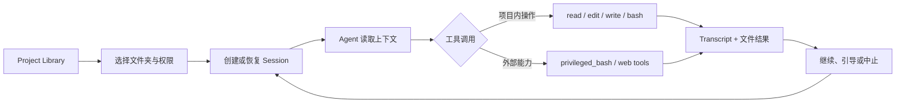
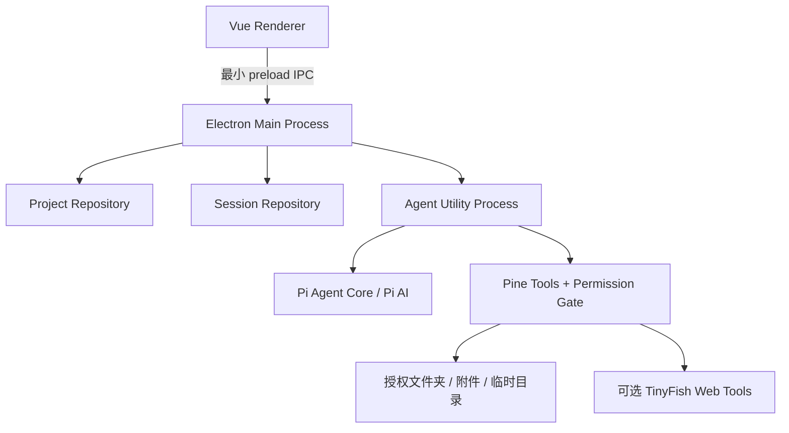

<p align="center">
  
</p>

<h1 align="center">Pine</h1>

<p align="center">
  <strong>致力于为所有人提供更多可能性的 AI 代理工作区。</strong><br />
  <sub>Agentic workspace dedicated to expanding possibilities for everyone.</sub>
</p>

<p align="center">
  
  
  
  
</p>

<p align="center">
  <a href="#当前状态">当前状态</a> ·
  <a href="#快速开始">快速开始</a> ·
  <a href="./docs/project-system.md">Project System</a> ·
  <a href="./docs/agent-execution-environment.md">执行环境</a>
</p>

> [!CAUTION]
> Pine 仍是超级早期的开发者预览版，不适合日常工作或重要数据。界面、数据格式、Agent 行为和项目结构都可能发生不兼容变更；当前不提供稳定版本、迁移或兼容性保证。

## Pine 是什么？

Pine 把项目文件、会话、上下文边界和 AI Agent 放进同一个可理解、可审查的桌面工作区：

```text
Project Library → 文件夹授权 → Agent 会话 → 工具调用 → 审批 / 接管 → 文件与结果
```

它不是一个隐藏执行细节的自动化黑箱，而是一个让用户看见 Agent 如何读取、思考、调用工具并修改本地文件的工作环境。

## 当前状态

| 项目     | 当前情况                                                                                                       |
| -------- | -------------------------------------------------------------------------------------------------------------- |
| 版本     | `0.1.0`，开发者预览版                                                                                          |
| 核心闭环 | Project Library → 文件夹授权 → 持久化会话 → Agent 工具调用 → 结果回显                                          |
| 已验证   | `bun run check` 通过；57 个测试文件、395 个测试通过，14 个跳过                                                 |
| 打包     | `bun run build` 已在 macOS arm64 完成 Electron Forge 打包流程                                                  |
| 发行     | CI 当前发布 macOS Apple Silicon / Intel nightly snapshot；Windows/Linux maker 已配置但尚未作为验证过的发布渠道 |

## 已经可以做什么？

| 能力                  | 当前实现                                                                                                              |
| --------------------- | --------------------------------------------------------------------------------------------------------------------- |
| **Project System v1** | 创建、搜索、打开、编辑、删除项目；一个项目可包含多个文件夹，支持只读 / 读写权限和默认工作目录                         |
| **文件工作区**        | 延迟加载文件树；新建、重命名、移动、删除、打开、显示路径、复制路径                                                    |
| **Agent loop**        | 流式回复、工具调用事件、持久化 Pi JSONL session、继续 / 中止 / 重命名 / 删除会话、全文搜索、steering 消息、上下文用量 |
| **本地工具**          | 受授权范围约束的 `read` / `write` / `edit` / `bash`，以及需要审批的 `privileged_bash`                                 |
| **模型与认证**        | Provider / model catalog、API key / OAuth 登录、模型切换、thinking level、utility model                               |
| **网络工具**          | 配置 TinyFish API key 后可使用 `web_search` / `web_fetch`，并校验 URL、域名、响应大小和私有网络地址                   |
| **附件与预览**        | 文件 / 文件夹附件、粘贴图片，以及文本、图片、视频、PDF、DOCX、XLS / XLSX、PPTX 预览                                   |
| **桌面体验**          | Vue Router + Pinia、多标签、中文 / 英文、浅色 / 深色 / 跟随系统主题、窗口快捷键、macOS 侧栏模糊                       |

## Agent 工作流



每个工具调用都会成为会话 transcript 的一部分。用户可以在执行前审批、拒绝或提供 guidance，也可以随时中止当前运行。

### 权限模式

| 模式              | 行为                                               | 适合场景                 |
| ----------------- | -------------------------------------------------- | ------------------------ |
| **Let Me Review** | 需要审批的调用逐一交给用户确认                     | 希望逐步审查 Agent 行动  |
| **Auto Approve**  | 在项目沙箱内自动执行；越过边界时请求审批           | 日常开发工作             |
| **YOLO**          | 关闭 Pine 的沙箱、文件夹限制和审批门；使用原生权限 | 仅适合明确理解风险的实验 |

普通工具的边界包括共享文件夹、用户显式附加的文件 / 目录、Pine 临时目录和必要的运行时文件。读取或写入其他外部路径、控制 GUI 或外部进程时，需要使用 `privileged_bash` 并重新审批。

## 架构概览



关键边界：

- Renderer 不直接访问 Node.js、文件系统或 shell。
- Main process 是 Project 元数据和当前窗口 runtime 的单一事实源。
- Agent runtime 在独立的 Electron utility process 中运行。
- 文件请求使用 `{ folderId, relativePath }`，由 Main process 校验路径边界。
- Project 元数据和 session 存放在 Electron `app.getPath("userData")` 下，用户项目目录不会被自动写入 `.pine/`。

### Pine 管理的数据

```text
<userData>/
└── projects/
    └── <project-id>/
        ├── project.json
        ├── sessions/
        ├── cache/
        └── attachments/
```

Pine 不复制、移动或接管项目文件夹；删除 Project 只删除 Pine 自己的 Project 目录，不删除被引用的用户文件。

## 路线图与明确未实现项

产品设计稿中的方向不等于当前版本的功能。以下项目仍未交付：

<details>
<summary>展开路线图</summary>

| 方向                                      | 状态   |
| ----------------------------------------- | ------ |
| Checkpoint / Git 快照、回滚和时间线       | 未实现 |
| 文件内批注、批注上下文和 annotation layer | 未实现 |
| Skill 生成、管理与启用                    | 未实现 |
| Workflow 图、takeaway 和更完整的任务编排  | 未实现 |
| 旧版 `.pine/` 数据导入与项目迁移          | 未实现 |
| 稳定版发行、自动更新和跨平台发布验证      | 未实现 |

完整的产品构想见 [`docs/framework.md`](./docs/framework.md)；它是历史设计讨论，不是当前实现清单。

</details>

## 快速开始

需要 [Bun](https://bun.sh/)，版本以根目录 `package.json` 的 `packageManager` 为准。

```bash
git clone https://github.com/Starlight-Intelligence/pine.git
cd pine
bun install --frozen-lockfile
bun run dev
```

在应用中创建一个 Project，选择 Agent 可以访问的文件夹，然后新建 Session 开始工作。

### 常用命令

| 命令                             | 用途                                   |
| -------------------------------- | -------------------------------------- |
| `bun run dev`                    | 启动桌面端开发环境                     |
| `bun run build`                  | 执行 Electron Forge 打包流程           |
| `bun run check`                  | 格式、Lint、类型检查与单元测试         |
| `bun run test`                   | 运行单元测试                           |
| `bun run test:coverage`          | 生成测试覆盖率报告                     |
| `bun run typecheck`              | 运行 TypeScript / Vue 类型检查         |
| `bun run shadcn:add <component>` | 使用固定版本的 shadcn-vue CLI 添加组件 |

## 仓库结构

```text
apps/
  desktop/       Electron 桌面端
packages/        预留的共享包目录
docs/            产品、架构与执行环境文档
```

技术栈：Electron Forge · Vue 3 · TypeScript · Vue Router · Pinia · shadcn-vue · Reka UI · Tailwind CSS v4 · Vitest · Bun workspace · Pi Agent Core。

## 文档导航

| 文档                                                                                         | 用途                                                    |
| -------------------------------------------------------------------------------------------- | ------------------------------------------------------- |
| [`docs/project-system.md`](./docs/project-system.md)                                         | Project System v1 的实现基准、存储、IPC 和 session 约束 |
| [`docs/agent-execution-environment.md`](./docs/agent-execution-environment.md)               | shell、临时目录、文件授权和 macOS 沙箱边界              |
| [`docs/architecture/pi-extension-boundary.md`](./docs/architecture/pi-extension-boundary.md) | Pi extension 与 Pine host 边界、session search 决策     |
| [`docs/framework.md`](./docs/framework.md)                                                   | 历史产品框架与路线图讨论；不作为当前实现清单            |

## 参与贡献

Pine 仍在快速迭代，欢迎 Issue、设计讨论和代码贡献。提交改动前请运行：

```bash
bun run check
```

项目约定：直接依赖使用精确版本，锁文件随依赖变更提交；提交遵循 [Conventional Commits](https://www.conventionalcommits.org/)；一个逻辑变更对应一个提交。更多约定见 [`AGENTS.md`](./AGENTS.md)。

## License

Pine is free software licensed under the [GNU General Public License v3.0 only](./LICENSE).
